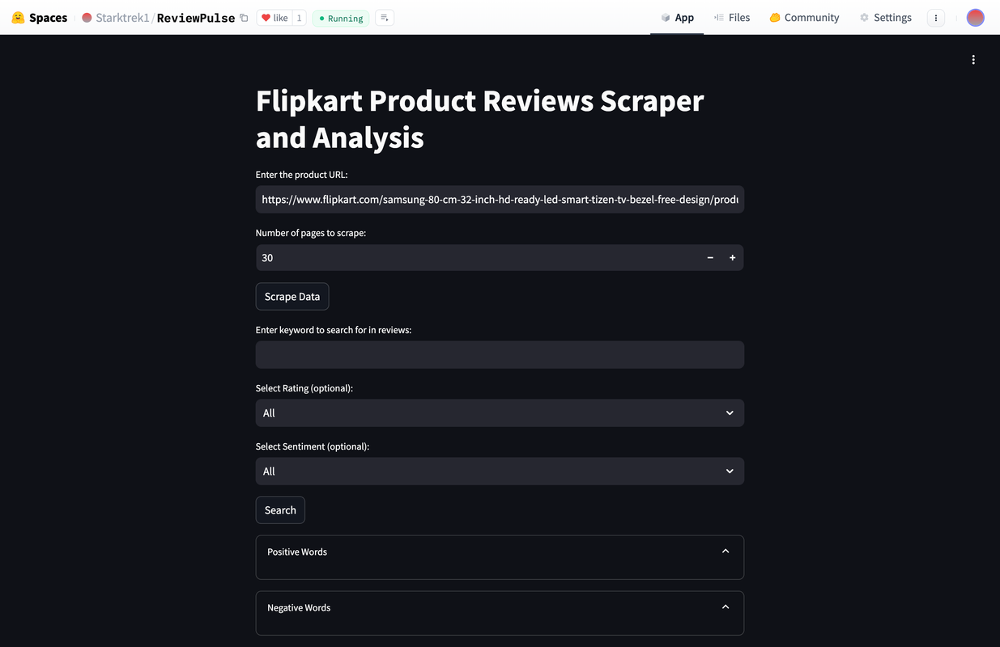
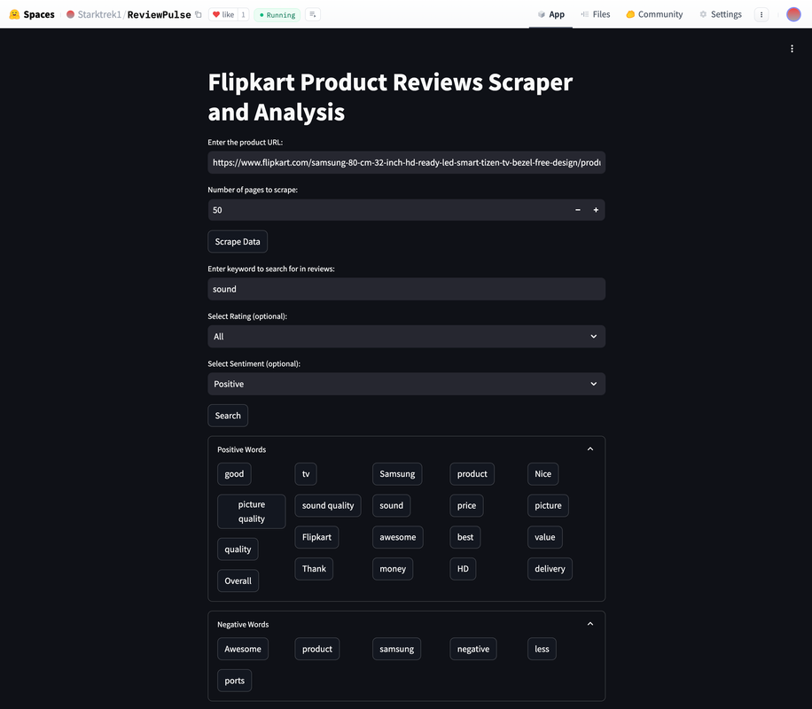
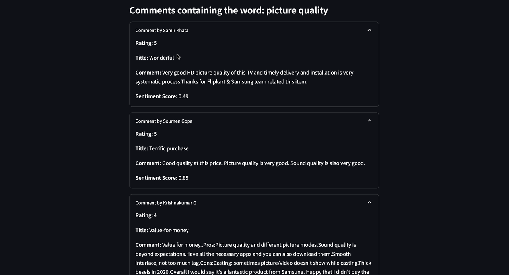
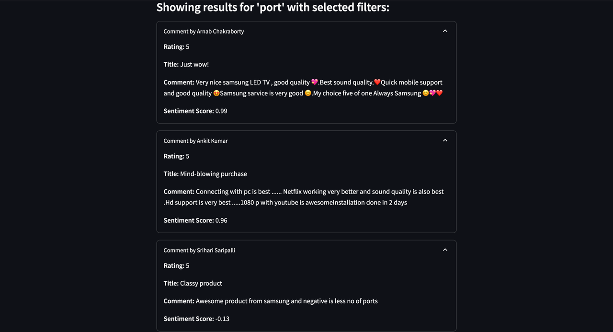

# ReviewPulse

**Site is live**  [ReviewPulse](https://huggingface.co/spaces/Starktrek1/ReviewPulse)

### Welcome to ReviewPulse! This Streamlit app allows users to scrape and analyze Flipkart product reviews. It provides valuable insights into product performance and sentiment, helping users make informed decisions quickly. Ideal for consumers and researchers alike.

## Features

- **Scrape Reviews:** Collect reviews from Flipkart products.
- **Sentiment Analysis:** Analyze and categorize reviews as positive or negative.
- **Search Reviews:** Search comments based on specific keywords, star ratings, or sentiment (positive or negative).
- **View Analysis:** See visual representations of sentiment and word clouds.

## Screenshots
- **Scrape Reviews:** In the product URL field, you can paste any Flipkart product link you want to analyze. You can also specify how many pages of reviews you want to analyze. After setting these options, click the "Scrape" button to start the analysis.



- **Word Cloud of Positive and Negative Comments:**  After data is scraped, the app performs sentiment analysis on the comments, identifies the most frequently used words, and displays them in a word cloud. You can select any word from the cloud to view comments containing that word.
  


- **Select a Word from the Word Cloud:** After selecting a word from the word cloud, click the corresponding button to view all comments related to that word, along with their sentiment scores (positive or negative).



- **Multiple Search Options:** You can search comments based on star ratings, sentiment (positive or negative), or specific keywords. For example, search for comments about "port in TV reviews" to find detailed information.



## Installation and Setup

Follow the steps below to set up and install the project dependencies.

### Setup


1. Navigate to the server directory:
   ```bash
   git clone https://github.com/StartrekI/ReviewPulse
2. Install server dependencies:
   ```bash
   cd reviewpulse
3. In .env write your MongoDB url
   ```bash
   pip install -r requirements.txt
  4.Run the Streamlit app:
   ```bash
   streamlit run app.py
